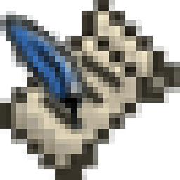

# 📚 Novel Manager Electron  

<!--suppress CheckImageSize -->

## ℹ Description
Novel Manager Electron is a desktop application that allows you to manage your local novel file.

❤ This application powered by ~~electron and vue~~ interest and love XD

💤 I'm busy with ~~video game~~ study, so I will not update is application very often. 

📖 I'm a lover of online novel, but I have no condition to always read novel online. Though may website serve download service. But when I need update it, the things will become much inconvenient.
So I have an idea develop a desktop application to manage the mountains of text file.That is it.

## ✅ Features
1. ⏬ download or update your novel.
2. 📚 add some books source, it is the source of book.

## 🔜 TODO
1. 🛑 text adblock. Remove annoying website ad inserted in text.
2. 📶 source trust level. when a books source have many incorrect and redundancy, this books source will be reduced using. Oppositely, when a books source do little incorrect, it will be used more.
3. 📗 book store and 🔎 search
4. ✂ split your novel by chapter, it will be useful when you need to limit your file size.

## 📜 License
This project is available under the [MIT License](https://github.com/Seidko/Novel-Manager-Electron/blob/master/LICENSE).
